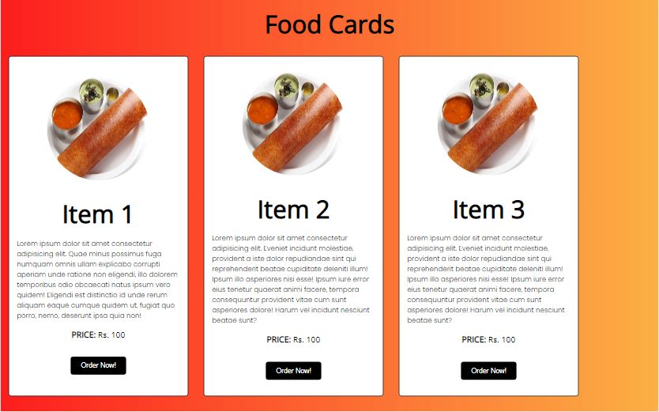

# Food Cards

 &nbsp; 

## Description:

This is a simple web app that allows you to create a list of food items and then randomly select one of them. It's useful for deciding what to eat when you're hungry. It consists of a single HTML file and a single JavaScript file.

## Output:

